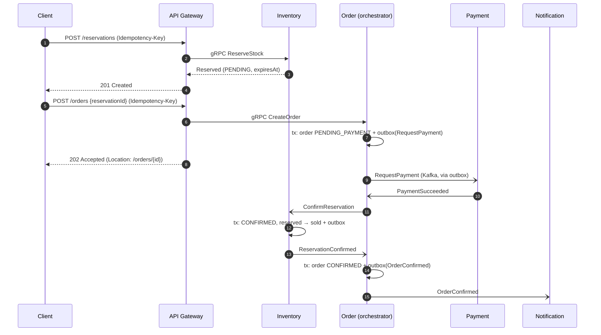

# HIGH-CONCURRENCY INVENTORY & RESERVATION PLATFORM

**A-to-Z Project Specification, Architecture, Engineering Principles & Interview Guide**

*Based on the reference document: High_Concurrency_Inventory_Reservation_Project_Specification.docx*
*Version 1.1 — reviewed and extended (see Section 45, Revision History)*

**Recommended implementation:** Java + Spring Boot  
**Portfolio objective:** demonstrate production-oriented backend engineering, concurrency, database depth, distributed systems, reliability, scalability, and observability — built with clean, maintainable code and documented engineering decisions.

| Item | Decision |
| :--- | :--- |
| Primary goal | Build one standout engineering project for Software Engineer / Backend / Full-Stack applications |
| Recommended language | Java (Java 21 or Java 25 LTS) |
| Backend framework | Spring Boot |
| Build tool | Maven (multi-module) |
| Code architecture | Hexagonal (ports & adapters) inside each service |
| Primary database | PostgreSQL (one schema per service) |
| DB migrations | Flyway |
| Cache / coordination | Redis |
| Event streaming | Apache Kafka (KRaft mode) |
| Service communication | REST externally; gRPC internally |
| Cross-service workflow | Orchestrated saga with compensating actions |
| Resilience | Resilience4j (timeouts, circuit breakers, bulkheads) |
| Testing | JUnit 5, Mockito, Testcontainers, ArchUnit |
| Load testing | k6 |
| Observability | OpenTelemetry, Prometheus, Grafana, Tempo/Jaeger, structured logs |
| Containerization | Docker / Docker Compose |
| Cloud / IaC | AWS + Terraform (optional production-style deployment) |
| CI/CD | GitHub Actions |
| Target build time | ~6 weeks (core tiers; see Section 37) |
| Local development cost | Can be kept at $0 by running the stack locally |

---

## Contents
1. Executive Overview
2. What Problem Does This Project Solve?
3. What the System Is Supposed to Do
4. Why This Project Is High-Impact for a Resume
5. Scope and Non-Goals
6. Non-Functional Requirements and Capacity Estimation
7. High-Level Architecture
8. Recommended Technology Stack
9. Software Design Principles and Code Architecture
10. Core Services, Responsibilities and Data Ownership
11. Functional Requirements
12. API Design and Contracts
13. Database Design
14. Concurrency Control
15. Transaction and Consistency Strategy
16. Distributed Workflow: State Machines and Saga
17. Redis Caching Strategy
18. Kafka and Event-Driven Architecture
19. Idempotency
20. Transactional Outbox Pattern
21. Reservation Expiry and Recovery
22. Retries, Dead-Letter Handling and Failure Recovery
23. Resilience: Timeouts, Circuit Breakers, Rate Limiting and Backpressure
24. Connection Pools and Resource Management
25. Observability
26. Load Testing, Benchmarking and Profiling
27. Failure Injection / Chaos Testing
28. Security
29. Testing Strategy
30. Engineering Workflow and Code Quality
31. Repository / Folder Structure
32. Local Development Environment
33. Deployment and Operational Readiness
34. AWS and Terraform Architecture
35. CI/CD
36. Engineering Documentation
37. Six-Week Implementation Roadmap and Prioritization
38. Definition of Done
39. What to Put in the GitHub README (and How to Showcase the Work)
40. Resume Entry
41. Interview Topics and Questions
42. What This Project Proves About You
43. What NOT to Over-Engineer
44. Final Recommended Stack
45. Revision History

---

## 1. Executive Overview
The High-Concurrency Inventory & Reservation Platform is a backend-heavy distributed system designed to model a difficult real-world problem: many customers competing for a limited quantity of inventory at the same time. The portfolio value comes from the engineering constraints rather than from a large UI.

The system should behave correctly when hundreds or thousands of purchase or reservation requests arrive concurrently. It must prevent overselling, avoid duplicate orders during retries, recover from partial failures, process work asynchronously, and remain observable and measurable under load.

This project is intentionally different from a normal CRUD application. Its main purpose is to demonstrate that you can reason about correctness, performance, consistency, failure modes, and trade-offs.

*   **Primary scenario:** flash-sale / limited-inventory reservation and checkout.
*   **Primary engineering question:** how do we keep inventory correct while many requests compete for the same scarce resource?
*   **Secondary engineering questions:** how do we cache safely, publish events reliably, keep a multi-service workflow consistent without distributed transactions, survive worker/API failures, and prove the system scales?

## 2. What Problem Does This Project Solve?
Imagine a product has only 100 units available. At the moment a sale starts, thousands of users attempt to buy it. A naive application can read the same stock value in many requests, decrement it independently, and accidentally oversell.

*   Request A reads stock = 1
*   Request B reads stock = 1
*   Request A writes stock = 0
*   Request B writes stock = 0
*   **Result:** two orders may exist for one physical unit.

The project solves this class of problem by making inventory a protected resource and explicitly designing the system around database transactions, concurrency control, idempotency, caching, asynchronous events, retries, and failure recovery.

**The business-style problem in one sentence:**  
Safely reserve and sell scarce inventory under high concurrent traffic without overselling, duplicating orders, or losing important events.

## 3. What the System Is Supposed to Do
The platform provides a small commerce/reservation flow with enough complexity to expose production-grade engineering challenges.

| Flow | Expected behavior |
| :--- | :--- |
| Browse products | Return product information quickly, preferably from cache after the first request. |
| Check availability | Return current availability while making the source of truth clear. |
| Create reservation | Atomically reserve inventory if sufficient quantity exists. |
| Cancel reservation | Release stock immediately when the user abandons checkout. |
| Enforce purchase limits | Prevent one user from exceeding the per-user limit, even with concurrent requests. |
| Create order | Create one logical order even if the client retries. |
| Process payment | Model an asynchronous payment workflow and explicit success/failure states. |
| Confirm order | Transition reservation/order states safely and emit events. |
| Compensate failures | When payment fails or times out, release stock and cancel the order automatically. |
| Expire reservation | Automatically release stock when a reservation passes its expiry time. |
| Notify customer | Process notifications asynchronously and recover from temporary failures. |
| Observe system | Expose logs, metrics, traces and operational dashboards. |

## 4. Why This Project Is High-Impact for a Resume
Your existing resume already demonstrates TypeScript/NestJS, PostgreSQL, AWS, microservices, message-driven communication, Kafka-related work, and AI/RAG systems. This project should therefore add a different kind of evidence: deep systems engineering.

| Current profile evidence | New project should add |
| :--- | :--- |
| NestJS / Node / TypeScript backend | Java / Spring Boot backend |
| Microservices / REST | Concurrency, transactional boundaries, gRPC, sagas |
| PostgreSQL usage | Indexes, EXPLAIN ANALYZE, isolation, row locks, pooling |
| Messaging / Kafka | Reliable event publication, retries, idempotent consumers, DLQ |
| AWS | Local-first architecture first; production-style AWS deployment later |
| Feature delivery | Benchmark-driven performance and reliability engineering |
| Building services | Explicit software design: hexagonal architecture, aggregates, invariants enforced in code, DB and tests |
| Shipping code | Written engineering decisions: NFRs, ADRs, postmortems, CI quality gates |

The strongest resume signal is not the number of services. It is the fact that you can demonstrate an engineering problem, reproduce it under load, explain the chosen solution, and show measurements before and after the optimization.

*Honest positioning note:* "flash-sale inventory" is a well-known system-design topic, so the topic alone will not differentiate you. The depth of evidence will: reproducible benchmarks, failure experiments, written decisions, and postmortems of bugs you found under load. Treat those artifacts as first-class deliverables, not afterthoughts.

## 5. Scope and Non-Goals

**In scope**
*   Product catalog and inventory
*   Reservations and order lifecycle
*   Concurrency control
*   Transactions and isolation
*   PostgreSQL indexing and query optimization
*   Redis caching and rate limiting
*   Kafka event workflows
*   Idempotency
*   Transactional outbox
*   Saga-based checkout with compensating actions
*   Retries and dead-letter processing
*   Timeouts, circuit breakers and load shedding
*   Reservation expiry
*   Non-functional requirements and capacity estimation
*   Clean, hexagonal code architecture with enforced rules
*   API design (OpenAPI, Problem Details errors, versioning)
*   Load testing
*   Observability
*   Failure injection
*   Docker local environment
*   Engineering documentation (ADRs, runbooks, postmortems)
*   Optional AWS/Terraform deployment
*   CI/CD

**Out of scope**
*   A polished consumer-grade storefront
*   Real financial payment processing with real money
*   Complex recommendation systems
*   Full warehouse management
*   Multi-region active-active deployment
*   A massive Kubernetes platform from day one
*   Event sourcing / full CQRS
*   Real email/SMS delivery (notifications are simulated)
*   "Exactly-once" end-to-end claims (the design is at-least-once + idempotency)

The project is a portfolio engineering system, not a production business that must be launched to real customers.

## 6. Non-Functional Requirements and Capacity Estimation
Functional requirements describe *what* the system does; non-functional requirements (NFRs) describe *how well* it must do it. Writing them down before building turns vague goals ("it should be fast") into targets you can test, and gives the benchmarks in Section 26 something to be measured against.

| ID | Category | Target (initial hypothesis — validate and revise with measurements) |
| :--- | :--- | :--- |
| NFR-1 | Correctness | Zero oversold units in every contention test. Hard requirement; never traded for performance. |
| NFR-2 | Duplicate protection | Zero duplicate orders or reservations for retried requests with the same `Idempotency-Key`. |
| NFR-3 | Latency | Reservation endpoint P99 < 300 ms at 1,000 concurrent users on the documented reference machine. |
| NFR-4 | Throughput | Document the maximum sustainable reservation attempts/second before NFR-3 is breached. |
| NFR-5 | Fast rejection | "Sold out" responses P99 < 50 ms once stock reaches zero. |
| NFR-6 | Event durability | Every committed business change produces its event (no lost events relative to the database, via outbox). |
| NFR-7 | Event freshness | Outbox publish lag P95 < 1 s under normal load. |
| NFR-8 | Recovery | Expired reservations release stock within 30 s of `expires_at`. |
| NFR-9 | Degradation | Product reads keep working when Redis is down; writes fail fast and explicitly when PostgreSQL is down. |
| NFR-10 | Observability | Any request can be followed end to end (HTTP → gRPC → DB → Kafka → consumer) by one trace ID. |
| NFR-11 | Operability | A clean clone starts with one command and passes a smoke test in under 10 minutes. |
| NFR-12 | Security | No endpoint returns another user's data; no secrets in the repository (enforced by CI scanning). |

If a target is missed, record the measured value and the reason in the README. An honest "missed, and here is the bottleneck" is a stronger interview story than an unverified claim.

**Reference environment:** record CPU, RAM, OS, Docker resource limits, JVM version, PostgreSQL version and dataset size alongside every benchmark. Numbers without their environment are not reproducible.

**Back-of-the-envelope capacity estimation (illustrative)**

| Assumption | Value |
| :--- | :--- |
| Users arriving at sale start | 50,000 |
| Arrival window | 80% within the first 10 seconds |
| Peak reservation attempts | ≈ 50,000 × 0.8 / 10 ≈ 4,000 requests/second |
| Product-page reads | ~5× attempts ≈ 20,000 requests/second (the cache must absorb these) |
| Units in stock | 100 |
| Attempts that must be rejected | ≥ 99.75% of the 40,000 attempts in the first 10 seconds |

The key insight from this estimate: at peak, the system's main job is not selling — it is **rejecting quickly and cheaply**. That shapes the design: keep the reservation transaction tiny, short-circuit once stock is gone (Section 14, approach D), cache reads aggressively, and shed load before it reaches the database. A laptop will not reach these numbers; the point is to show that you can reason about scale and design for it.

## 7. High-Level Architecture
```text
                           Web Client / k6
                                 |
                            REST / JSON
                                 |
                   +-------------v--------------+
                   |        API Gateway         |---- Redis (rate limits)
                   |        Spring Boot         |
                   +------+---------------+-----+
                          |               |
                        gRPC            gRPC
                          |               |
               +----------v----+   +------v---------+                   +--------------+
   Redis ------|   Inventory   |   |     Order      |---- commands ---->|   Payment    |
  (product     |    Service    |   |    Service     |   (via Kafka)     |   Service    |
   cache)      |               |   | (saga orchestr)|                   | (simulated)  |
               +-------+-------+   +-------+--------+                   +------+-------+
                       |                   |                                   |
               inventory schema       order schema                      payment schema
               + outbox / inbox       + outbox / inbox                  + outbox / inbox
                       |                   |                                   |
                       +------------- outbox relay (per service) --------------+
                                           |
                                 +---------v----------+
                                 |       Kafka        |
                                 +--+------+-------+--+
                                    |      |       |
                      Expiry/Reconcile  Notification  Service consumers
                      Worker (Inventory)   Worker     (idempotent via inbox)

   Locally: one PostgreSQL instance, one schema + one database user per service.
   No service reads or writes another service's tables.
```

**Recommended implementation principle:** start with three core services and keep the deployment simple. Do not create a microservice for every table. Service boundaries should exist because of responsibility, scaling, failure isolation, or ownership—not because microservices look impressive.

**Architecture rules**
*   **Each service owns its data.** Sharing one database between services (all services reading and writing the same tables) is a well-known anti-pattern: it couples deployments and schemas, and it hides the real distributed-consistency problem. One PostgreSQL *instance* with one *schema per service* keeps local development cheap while keeping ownership honest.
*   **Cross-service consistency is handled by a saga, not a distributed transaction** (Section 16).
*   **Synchronous calls are for queries and the user-facing critical path; everything else is asynchronous through Kafka via the outbox.**
*   **Every remote call has a timeout** (Section 23).

## 8. Recommended Technology Stack

| Layer | Recommended technology | Why it is used |
| :--- | :--- | :--- |
| Language | Java 21 or Java 25 LTS | Adds a new backend ecosystem to the resume while remaining highly relevant to enterprise/backend roles. Java 25 also includes the virtual-thread pinning fix (JEP 491). |
| Framework | Spring Boot | Production-oriented HTTP, dependency injection, validation, transactions, actuator and ecosystem support. |
| Build | Maven multi-module | The most common build tool in enterprise Java; simple, well-documented, works with every CI. |
| External API | REST / JSON + OpenAPI (springdoc) | Simple client integration, easy demonstration, generated API docs. |
| Internal API | gRPC + Protocol Buffers (+ buf) | Strongly typed service-to-service communication with lint and breaking-change checks. |
| Database | PostgreSQL | Transactions, locking, isolation, indexes, query planning and a strong relational consistency model. |
| Migrations | Flyway | Versioned, reviewable, repeatable schema changes. |
| DB access | Spring Data JPA + Spring JDBC | Use JPA where convenient; use JDBC/native SQL where understanding and controlling SQL matters. |
| Cache | Redis | Cache-aside reads, rate limiting, idempotency support and selective coordination. |
| Streaming | Apache Kafka (KRaft) | Asynchronous events, consumer groups, ordering considerations and replay/recovery concepts. |
| Resilience | Resilience4j | Circuit breakers, bulkheads, retries and time limiters with metrics. |
| Testing | JUnit 5 + Mockito + Testcontainers + ArchUnit + Awaitility | Unit, integration, architecture-rule and async tests against realistic dependencies. |
| Load testing | k6 | Controlled concurrent traffic and latency/error benchmarking. |
| Fault injection | Toxiproxy | Reproducible latency, timeouts and network partitions in tests. |
| Observability | OpenTelemetry + Prometheus + Grafana + Tempo/Jaeger + Loki | Tracing, metrics, logs and operational dashboards. |
| Logging | Structured JSON logs | Machine-readable production-style logs with correlation IDs. |
| Containerization | Docker + Docker Compose | Reproducible local environment. |
| Cloud | AWS | Cloud deployment and operational familiarity. |
| IaC | Terraform | Repeatable infrastructure provisioning. |
| CI/CD | GitHub Actions | Automated test/build pipeline and optional deployment. |

*Why Java instead of Go for this project:* Go is excellent for concurrency and systems programming, but Java gives this particular portfolio project a strong combination of a new language for you, Spring/enterprise backend exposure, broad hiring relevance, and enough tooling to demonstrate concurrency, transactions, messaging and observability deeply. Go remains a good future learning target for a dedicated concurrency/systems project.

## 9. Software Design Principles and Code Architecture
Reviewers and interviewers will read your code, not just your README. The systems work proves you understand distributed behavior; the code structure proves you can build software that other engineers can maintain. This section defines how code inside each service is organized.

### A. Hexagonal architecture (ports and adapters) inside each service
```text
        inbound adapters                                    outbound adapters
  REST controller / gRPC server / Kafka consumer     JDBC/JPA repos, outbox writer, Redis, gRPC client
                 |                                                   ^
                 v                                                   |
      +--------------------------------------------------------------------+
      |  application layer: use cases, transaction boundaries              |
      |     +----------------------------------------------------------+   |
      |     |  domain layer: aggregates, value objects, domain events, |   |
      |     |  invariants, ports (interfaces). Pure Java, no Spring.   |   |
      |     +----------------------------------------------------------+   |
      +--------------------------------------------------------------------+
```
*   **Dependency rule:** adapters → application → domain. The domain imports nothing from Spring, JPA, Kafka or gRPC.
*   Domain unit tests run in milliseconds with no Spring context.
*   Swapping JPA for JDBC, or REST for gRPC, touches only adapters.
*   The rule is enforced automatically with ArchUnit tests (Section 29), so it cannot erode silently.

**Package layout example (Inventory Service)**
```text
com.stockforge.inventory
├── domain
│   ├── model        # Inventory, Reservation, Quantity, Money, ReservationStatus
│   ├── event        # ReservationCreated, ReservationExpired (records)
│   └── port         # InventoryRepository, ReservationRepository, EventPublisher
├── application      # ReserveStockUseCase, ConfirmReservationUseCase, ExpireReservationsUseCase
├── adapter
│   ├── in
│   │   ├── grpc     # InventoryGrpcService
│   │   └── kafka    # ConfirmReservationCommandListener
│   └── out
│       ├── persistence  # JDBC/JPA implementations of repository ports
│       └── messaging    # OutboxEventPublisher
└── config           # Spring wiring, @ConfigurationProperties
```

### B. Domain-driven design (pragmatic, not ceremonial)
| Concept | How it appears in this project |
| :--- | :--- |
| Bounded context | Inventory, Ordering, Payment — one per service, each with its own model and language. |
| Aggregate | `Inventory` (per product), `Reservation`, `Order`, `Payment`. Invariants are enforced inside the aggregate. |
| Value object | `Quantity` (positive integer), `Money` (amount + currency), `Sku`, `ReservationId` — immutable records that validate in their constructor. |
| Domain event | `ReservationCreated`, `OrderConfirmed`, … raised by aggregates and persisted via the outbox. |
| Ubiquitous language | The same terms in code, API, events and docs: *reserve*, *confirm*, *release*, *expire*, *compensate*. |

### C. SOLID applied to this codebase
| Principle | Concrete application |
| :--- | :--- |
| Single responsibility | `ReserveStockUseCase` reserves; `ExpireReservationsUseCase` expires; controllers only translate HTTP. |
| Open/closed | A new locking strategy is a new `StockReservationStrategy` implementation, with no change to callers. |
| Liskov substitution | All strategies honor the same contract and pass the same concurrency test suite. |
| Interface segregation | Narrow ports (`ReservationRepository`, `EventPublisher`) rather than one giant DAO. |
| Dependency inversion | Domain and application depend on port interfaces; adapters implement them. |

### D. Design patterns that earn their place
| Pattern | Where | Why |
| :--- | :--- | :--- |
| Strategy | Pessimistic / optimistic / atomic reservation strategies | Lets the Section 14 experiment swap implementations behind one interface and one test suite. |
| State machine | Reservation, order and payment lifecycles | Makes illegal transitions impossible to express (Section 16). |
| Repository | Persistence ports | Keeps SQL out of business logic. |
| Transactional outbox | Event publication | Atomic state change + event (Section 20). |
| Saga (orchestration) | Checkout across services | Consistency without distributed transactions (Section 16). |
| Adapter | REST / gRPC / Kafka edges | Isolates transport concerns from the domain. |

### E. Modern Java used deliberately
```java
// Expected business outcomes are values, not exceptions.
public sealed interface ReservationResult {
    record Reserved(ReservationId id, Instant expiresAt) implements ReservationResult {}
    record InsufficientStock(ProductId productId, Quantity requested) implements ReservationResult {}
    record PurchaseLimitExceeded(UserId userId, int limit) implements ReservationResult {}
}

// The adapter maps every case; the compiler reports any case you forget.
return switch (result) {
    case Reserved r              -> created(r);
    case InsufficientStock s     -> conflict(s);
    case PurchaseLimitExceeded l -> unprocessable(l);
};
```
*   Records for value objects, DTOs and events; sealed interfaces + pattern matching for closed result/event hierarchies.
*   Virtual threads for I/O-bound request handling (Section 24).
*   `java.time.Clock` injected wherever time matters, so expiry logic is testable without sleeping.
*   Typed, validated `@ConfigurationProperties` instead of scattered `@Value` strings.

### F. Clean code and defensive design rules
*   Keep request DTOs, domain objects and persistence entities separate — prevents mass-assignment bugs and leaking the schema into APIs.
*   Enforce each important invariant in three places: domain model, database constraint and an automated test (defense in depth).
*   One consistent error model: domain results are mapped to Problem Details (REST) or status codes (gRPC) only in adapters.
*   No magic numbers: TTLs, limits, pool sizes and retry counts live in configuration.
*   Comments explain *why*, not *what*; non-obvious decisions link to their ADR.
*   Share only contracts (proto files, event schemas) between services — never a shared domain library, which would couple deployments and create a distributed monolith.

## 10. Core Services, Responsibilities and Data Ownership

| Service | Responsibilities |
| :--- | :--- |
| API Gateway / API service | Authentication, request routing, rate limits, `Idempotency-Key` header validation (keys are stored by the owning service — Section 19) and API aggregation where needed. |
| Inventory Service | Inventory source of truth, product catalog, reservations, stock decrement/release, locking and concurrency rules. |
| Order Service | Order creation, order state machine, order history, idempotency-aware order commands and checkout saga orchestration. |
| Payment Service | Simulated payment workflow with asynchronous outcomes, timeouts and retryable failures. |
| Inventory Worker | Reservation expiry and background reconciliation tasks. |
| Notification Worker | Email/notification simulation, retries and dead-letter handling. |

*You may merge API Gateway + Order Service during early development. The architecture is allowed to evolve as the project matures.*

**Data ownership**

| Service | Owns (own schema) | Publishes | Consumes |
| :--- | :--- | :--- | :--- |
| API Gateway | `users` (only if local auth is used) | — | — |
| Inventory Service (+ expiry/reconciliation worker) | `products`, `inventory`, `reservations`, its `idempotency_keys`, outbox, inbox | `inventory-events` | `inventory-commands` |
| Order Service (saga orchestrator) | `orders`, `order_items`, `order_status_history`, its `idempotency_keys`, outbox, inbox | `order-events`, `payment-commands`, `inventory-commands` | `inventory-events`, `payment-events` |
| Payment Service | `payments`, outbox, inbox | `payment-events` | `payment-commands` |
| Notification Worker | inbox (optional notification log) | — | `order-events` |

*   Each service's database user has privileges only on its own schema, so the ownership rule is enforced by the database rather than by discipline.
*   Workers are deployment units of the service that owns their data (the expiry worker belongs to Inventory).
*   Cross-service data access goes through APIs or events, never through cross-schema joins.

## 11. Functional Requirements

| ID | Area | Requirement | Acceptance criteria (examples) |
| :--- | :--- | :--- | :--- |
| FR-1 | Products | Create/list/get products with price and inventory metadata. | List is paginated; detail is served from cache after the first read; unknown ID → 404. |
| FR-2 | Inventory | Query availability and maintain available/reserved quantities. | Stock-conservation invariant always holds; cached availability is labelled approximate. |
| FR-3 | Reservations | Create, confirm, cancel and expire reservations. | Insufficient stock is rejected rather than going negative; only `PENDING` reservations can be confirmed, cancelled or expired. |
| FR-4 | Purchase limits | Limit units per user per product during a sale (e.g., max 2). | Concurrent requests from the same user cannot exceed the limit (write-skew test, Section 15). |
| FR-5 | Orders | Create an order from a valid reservation; expose current status and history. | One order per reservation (DB unique constraint); history shows every transition with timestamp and reason. |
| FR-6 | Payments | Simulate asynchronous payment success, failure, timeout and retry. | Outcome is controllable in non-production profiles (e.g., a simulation header) for deterministic tests. |
| FR-7 | Compensation | Failed or timed-out payments release stock and cancel the order. | Stock returns to available; order becomes `CANCELLED`; customer is notified. |
| FR-8 | Events | Publish domain events for state transitions. | Every transition writes its event to the outbox in the same transaction. |
| FR-9 | Notifications | Send simulated confirmation/failure notifications asynchronously. | Duplicate events never produce duplicate notifications. |
| FR-10 | Admin operations | Optional endpoints for stock adjustment and event replay/reconciliation. | Admin role required; every action is written to `audit_logs`. |

## 12. API Design and Contracts
A clean, predictable API is often the first thing a reviewer touches. Design it deliberately.

**REST endpoints (external)**

| Method & path | Purpose | Success | Notable errors |
| :--- | :--- | :--- | :--- |
| `GET /api/v1/products?limit=&cursor=` | List products (keyset pagination) | 200 | 400 |
| `GET /api/v1/products/{productId}` | Product detail (cached) | 200 (+ `ETag`) | 404 |
| `GET /api/v1/products/{productId}/availability` | Approximate availability | 200 | 404 |
| `POST /api/v1/reservations` | Reserve stock; requires `Idempotency-Key` | 201 + `Location` | 409 insufficient stock, 422 limit exceeded, 429 |
| `GET /api/v1/reservations/{id}` | Reservation status | 200 | 404 (also for other users' reservations) |
| `POST /api/v1/reservations/{id}/cancel` | Cancel a pending reservation | 200 | 409 invalid state |
| `POST /api/v1/orders` | Create order from a reservation; requires `Idempotency-Key` | 202 + `Location` (payment is async) | 409 reservation expired/used, 422 |
| `GET /api/v1/orders/{id}` | Order status and history | 200 | 404 |
| `GET /api/v1/orders?cursor=` | Caller's order history | 200 | 400 |
| `POST /api/v1/admin/products/{id}/stock-adjustments` | Audited stock adjustment | 201 | 403 |
| `POST /api/v1/admin/dead-letters/{topic}/replay` | Replay dead-lettered messages | 202 | 403 |

**Conventions**
*   **Versioning:** URI prefix `/api/v1`; breaking changes create `/v2`, additive changes do not.
*   **Errors:** RFC 9457 Problem Details (`application/problem+json`), supported natively by Spring's `ProblemDetail`. One format for every error, including validation errors.
    ```json
    {
      "type": "https://example.com/problems/insufficient-stock",
      "title": "Insufficient stock",
      "status": 409,
      "detail": "Requested 2 units of SKU-123 but they are no longer available.",
      "instance": "/api/v1/reservations",
      "traceId": "4bf92f3577b34da6a3ce929d0e0e4736"
    }
    ```
*   **Asynchronous operations:** `POST /orders` returns `202 Accepted` with a `Location` header; clients poll `GET /orders/{id}` (server-sent events are a stretch goal).
*   **Pagination:** cursor/keyset pagination, which stays fast on large tables and matches the index design in Section 13.
*   **Documentation:** OpenAPI 3 generated with springdoc-openapi and checked into the repository; CI detects breaking changes.
*   **Status codes carry meaning:** 409 for state conflicts, 422 for business-rule violations, 429 for per-client limits, 503 + `Retry-After` for system saturation.

**gRPC contracts (internal)**

| Domain outcome | gRPC status |
| :--- | :--- |
| Insufficient stock / invalid state | `FAILED_PRECONDITION` |
| Optimistic conflict after retries exhausted | `ABORTED` |
| Unknown entity | `NOT_FOUND` |
| Invalid input | `INVALID_ARGUMENT` |
| Caller's deadline passed | `DEADLINE_EXCEEDED` |
| Dependency temporarily down (retryable) | `UNAVAILABLE` |

*   Every call carries a deadline (Section 23).
*   Proto evolution rules: never reuse or renumber fields, mark removed fields `reserved`, add fields as optional. Enforce with `buf lint` and `buf breaking` in CI.

## 13. Database Design
PostgreSQL is the source of truth for inventory and transactional business state. Redis is not the authoritative inventory database.

| Table | Owner | Important columns / purpose |
| :--- | :--- | :--- |
| `users` | Gateway / identity | id, email, created_at |
| `products` | Inventory | id, sku (unique), name, price_amount, currency, status, created_at, updated_at |
| `inventory` | Inventory | product_id, total_quantity, available_quantity, reserved_quantity, sold_quantity, version, updated_at |
| `reservations` | Inventory | id, user_id, product_id, quantity, status, expires_at, created_at, updated_at |
| `orders` | Order | id, user_id, reservation_id (unique), status, total_amount, currency, created_at, updated_at |
| `order_items` | Order | order_id, product_id, quantity, unit_price (price snapshot at order time) |
| `order_status_history` | Order | order_id, from_status, to_status, reason, occurred_at — powers the "status history" requirement |
| `payments` | Payment | id, order_id, amount, currency, status, provider_reference, attempt_count, created_at, updated_at |
| `idempotency_keys` | Each writing service | key, user_id, request_hash, status, response_status, response_payload, created_at, expires_at |
| `outbox_events` | Each service | id (= event ID), aggregate_type, aggregate_id, event_type, payload, headers (trace context), status, attempts, last_error, created_at, published_at |
| `processed_events` | Each consuming service | consumer_group, event_id, processed_at — consumer idempotency (inbox) |
| `audit_logs` | Owning service | id, actor_id, action, aggregate_type, aggregate_id, metadata, created_at |

**Important inventory invariant**
*   `available_quantity >= 0`
*   `reserved_quantity >= 0`
*   `available_quantity + reserved_quantity <= total_quantity` (when `total_quantity` is modeled)

Choose one canonical representation and enforce it with application logic plus database constraints where practical.

**Recommended canonical representation — stock conservation:** every unit is in exactly one bucket, so `available + reserved + sold = total` at all times. This single equation is easy to enforce, easy to check after every load test, and easy to explain.
```sql
CREATE TABLE inventory (
    product_id          UUID PRIMARY KEY REFERENCES products (id),
    total_quantity      INT         NOT NULL CHECK (total_quantity >= 0),
    available_quantity  INT         NOT NULL CHECK (available_quantity >= 0),
    reserved_quantity   INT         NOT NULL CHECK (reserved_quantity >= 0),
    sold_quantity       INT         NOT NULL CHECK (sold_quantity >= 0),
    version             BIGINT      NOT NULL DEFAULT 0,
    updated_at          TIMESTAMPTZ NOT NULL DEFAULT now(),
    CONSTRAINT inventory_stock_conservation
        CHECK (available_quantity + reserved_quantity + sold_quantity = total_quantity)
);
```

**Constraints that turn bugs into errors**
*   `UNIQUE (reservation_id)` on `orders` — one order per reservation, guaranteed by the database even if application logic has a bug.
*   `UNIQUE (user_id, key)` on `idempotency_keys`.
*   `PRIMARY KEY (consumer_group, event_id)` on `processed_events`.
*   `CHECK (quantity > 0)` on reservations and order items; status columns restricted to known values (CHECK or enum).

**Index plan (justify each with EXPLAIN ANALYZE on a large dataset)**

| Query | Index |
| :--- | :--- |
| Expiry scan: `status = 'PENDING' AND expires_at < now()` | Partial index `ON reservations (expires_at) WHERE status = 'PENDING'` |
| Outbox poll: pending events oldest first | Partial index `ON outbox_events (created_at) WHERE status = 'PENDING'` |
| User order history, newest first, keyset pagination | Composite `ON orders (user_id, created_at DESC, id)` |
| Product lookup by SKU | Unique `ON products (sku)` |
| Per-user active reservations (purchase limit) | `ON reservations (user_id, product_id) WHERE status IN ('PENDING', 'CONFIRMED')` |

Every index slows down writes on its table — keep the hot `inventory` table lean.

**Data-modelling decisions**
*   **Money:** `NUMERIC(19,4)` (or integer minor units) plus a `currency` column; `BigDecimal` or a `Money` value object in Java. Never `float`/`double`.
*   **Time:** `TIMESTAMPTZ`, stored in UTC.
*   **Identifiers:** UUIDs for public IDs so orders cannot be enumerated; prefer time-ordered UUIDv7 for better index locality (built into PostgreSQL 18 as `uuidv7()`, or generate in the application).
*   **Reservation granularity:** the MVP uses one SKU per reservation (typical for flash sales, and it keeps the hot path simple). Multi-item reservations (`reservation_items`, with deterministic lock ordering) are a stretch goal.

**Migrations and test data**
*   Flyway versioned migrations per service schema; never edit a migration that has been applied — add a new one.
*   A seed generator (e.g., `generate_series`) that creates realistic volumes — for example 100k products and 1–5M orders — so EXPLAIN ANALYZE results reflect real query plans rather than a 10-row table.
*   Enable `pg_stat_statements` locally to find the most expensive queries.

## 14. Concurrency Control
This is the core learning objective. Two or more requests must never be allowed to race into an invalid inventory state.

### A. Pessimistic locking
```sql
BEGIN;
SELECT available_quantity
FROM inventory
WHERE product_id = ?
FOR UPDATE;

-- validate quantity
-- update inventory
COMMIT;
```
The row is locked during the transaction. This is straightforward to reason about for scarce shared inventory, but concurrent requests may wait on the same row.

### B. Optimistic locking
```sql
UPDATE inventory
SET available_quantity = available_quantity - 1,
    reserved_quantity = reserved_quantity + 1,
    version = version + 1
WHERE product_id = ?
  AND version = ?
  AND available_quantity > 0;
```
The update succeeds only if the version still matches. Conflicts are detected rather than serialized by waiting on the lock.

*Note:* in PostgreSQL the `available_quantity > 0` predicate alone already prevents overselling (see approach C). The version column becomes essential when the application reads an entity, computes the new state in memory and writes it back — for example a JPA entity with `@Version` — which is the realistic optimistic-locking scenario to benchmark. Expect a high conflict and retry rate on a single hot row.

### C. Atomic conditional update (recommended baseline)
```sql
UPDATE inventory
SET available_quantity = available_quantity - :qty,
    reserved_quantity  = reserved_quantity  + :qty,
    updated_at         = now()
WHERE product_id = :productId
  AND available_quantity >= :qty;
-- 1 row updated  -> reserved (insert the reservation row in the same transaction)
-- 0 rows updated -> insufficient stock (no retry needed)
```
One round trip, no read-then-write gap and no application retry loop. Under READ COMMITTED, concurrent updates of the same row queue on the row lock; when the first commits, PostgreSQL re-evaluates the next update's `WHERE` clause against the newly committed row, so the stock check never uses stale data. This is often the best default — the experiment should show whether it is for your workload.

### D. Redis sold-out gate in front of the database (stretch)
An atomic Redis counter per SKU (decremented in a Lua script) rejects requests once the gate shows no stock, so the database only sees requests that have a real chance of succeeding. PostgreSQL remains the final authority: the gate may only *reject early*, never confirm a sale. Released and expired reservations must increment the gate again, and a reconciliation job resets the gate from the database. Measure how much database load and rejection latency it removes, and document the drift risk.

### E. Hot-row contention (stretch)
In a flash sale every request targets one `inventory` row, so approaches A–C all serialize on a single row lock, and that lock's hold time caps throughput. Options in order of complexity:
1.  Shorten the critical section: one statement, no remote calls inside the transaction, few indexes on the hot table.
2.  Reject early once stock is gone (approach D).
3.  Inventory bucketing: split stock into N rows `(product_id, bucket)`; each request tries a random bucket and falls back to others. Throughput rises roughly with N, at the cost of more complex availability reads.
4.  Single-writer queue: route reservation commands for a SKU through one Kafka partition and apply them sequentially (turns the API asynchronous).

### F. Deadlocks, timeouts and retryable errors
*   Multi-row operations must lock rows in a deterministic order (e.g., `ORDER BY product_id`) to avoid deadlocks.
*   Set `lock_timeout` and `statement_timeout` so a waiting request fails fast instead of holding a pooled connection indefinitely.
*   Treat SQLSTATE `40001` (serialization failure) and `40P01` (deadlock detected) as retryable: retry the *whole transaction* with bounded attempts and jittered backoff. Never retry a constraint violation.

**Engineering experiment**
| Experiment | What to measure |
| :--- | :--- |
| Naive implementation | Demonstrate race condition / overselling. |
| Pessimistic locking | Success count, P95/P99 latency, lock contention. |
| Optimistic locking | Conflict rate, retries, P95/P99 latency, throughput. |
| Atomic conditional update | Throughput and P99 compared with A/B; zero application retries. |
| Platform vs virtual threads | Throughput, P99 and pool wait time for the winning strategy. |
| Redis gate + DB (stretch) | Database load and rejection latency once sold out. |
| Inventory bucketing (stretch) | Throughput gain on one hot SKU versus added complexity. |

Implement each strategy behind the same `StockReservationStrategy` interface (Section 9) so all of them run against one shared concurrency test suite and one k6 script.

Do not claim one method is universally best. Explain why a method is appropriate for the workload and what trade-off you observed.

## 15. Transaction and Consistency Strategy
Use explicit transactional boundaries. Inventory reservation is not a collection of independent SQL statements; it is one business operation with invariants.
*   **Atomic reservation:** stock validation and stock mutation occur in one transaction.
*   **Order creation:** order state and related business records are committed consistently.

Do not pretend a database transaction automatically makes Kafka publication atomic. Use the outbox pattern for that cross-system reliability problem.

Define where strong consistency is required and where eventual consistency is acceptable.

| Data / interaction | Consistency model | Why |
| :--- | :--- | :--- |
| Inventory counts on the write path | Strong (single DB transaction) | Overselling is unacceptable. |
| A user reading their own order after creating it | Read-your-writes (Order Service DB) | Avoids confusing "order not found" right after creation. |
| Product availability shown on product pages | Eventual (cached, seconds stale, labelled approximate) | Read volume is huge; the reservation path re-checks the DB. |
| Cross-service checkout state | Eventual, converging via saga events and timeouts | No distributed transaction across services (Section 16). |
| Notifications | Eventual, at-least-once with deduplication | Delay is acceptable; duplicates are not. |

**Transaction boundary rules**
*   The application layer (use case) owns the transaction; adapters never open transactions and the domain knows nothing about them.
*   **Never make a network call (gRPC, HTTP, Kafka send, Redis) inside a database transaction.** It stretches lock hold time, ties a pooled connection to another system's latency, and still cannot make the remote side atomic.
*   Keep transactions short; do validation that does not need the database before opening one.

**Isolation levels to understand**
*   READ COMMITTED
*   REPEATABLE READ
*   SERIALIZABLE

The project should include a small test or README experiment explaining which isolation behavior matters for the inventory use case and what additional contention stronger isolation may create.

*PostgreSQL specifics worth knowing:* REPEATABLE READ is snapshot isolation; if a concurrent transaction already updated the row you try to update, your transaction aborts with `40001` instead of re-checking like READ COMMITTED does. SERIALIZABLE (SSI) also aborts with `40001` on dangerous patterns. Stronger isolation therefore changes your retry strategy, not just which anomalies are prevented.

**Write-skew experiment (per-user purchase limit)**  
"At most 2 units per user per product" is often implemented as `SELECT SUM(quantity) … WHERE user_id = ? AND product_id = ?` followed by an `INSERT`. If that check runs as a separate read before any lock is taken, two concurrent requests from the same user can both read 1 and both insert, ending at 3 — no row was updated twice, so classic row locking does not prevent it. This is *write skew*. Reproduce it in a test, then compare fixes: a per-user counter row updated with a conditional `UPDATE` and a CHECK constraint, SERIALIZABLE isolation with retry on `40001`, or (for a limit of 1) a partial unique index. Note that an incidental lock on the hot inventory row can hide the anomaly depending on statement order — which is exactly why the rule deserves its own explicit test. This experiment shows you understand isolation anomalies beyond the classic lost update.

## 16. Distributed Workflow: State Machines and Saga
Checkout spans three services that each own their data, so no single database transaction can cover it. Distributed transactions (2PC/XA) are deliberately avoided: they make every participant's availability depend on the others and are poorly supported by Kafka and managed cloud databases. Instead, the workflow is a **saga**: a sequence of local transactions, each publishing an event, with a **compensating action** for every step that may need undoing.

### A. State machines
**Reservation**
```text
           reserve
  (none) ----------> PENDING ---- payment confirmed -------> CONFIRMED  (reserved -> sold)
                        |
                        +-------- user cancel / payment failed -> CANCELLED  (reserved -> available)
                        |
                        +-------- expires_at passed -----------> EXPIRED    (reserved -> available)
```
**Order**
```text
  PENDING_PAYMENT ---- payment succeeded + reservation confirmed ----> CONFIRMED
        |
        +------------- payment failed / timed out / reservation released -> CANCELLED
        |
        +------------- payment succeeded but reservation already expired -> REFUND_PENDING -> REFUNDED
```
**Payment**
```text
  PENDING ---> SUCCEEDED ---> REFUNDED
     |
     +-------> FAILED
     +-------> TIMED_OUT
```

**Rules**
*   Terminal states are final. Every transition is a conditional update, so an illegal or duplicate transition affects zero rows:
    ```sql
    UPDATE reservations
    SET status = 'CONFIRMED', updated_at = now()
    WHERE id = :id AND status = 'PENDING';
    -- 0 rows: already confirmed (duplicate message -> no-op)
    --         or expired/cancelled (-> compensation path)
    ```
*   Every transition writes a history row and an outbox event in the same transaction.
*   The domain model also rejects illegal transitions, so the rule is enforced in both code and SQL.

### B. Saga steps and compensations (orchestrated by the Order Service)
| Step | Service | Local transaction | Compensation |
| :--- | :--- | :--- | :--- |
| 1 | Inventory | Reserve stock → reservation `PENDING` | Release: `CANCELLED`, reserved → available |
| 2 | Order | Create order `PENDING_PAYMENT` linked to the reservation; emit `RequestPayment` | Mark order `CANCELLED` |
| 3 | Payment | Execute simulated payment → `SUCCEEDED` / `FAILED` / `TIMED_OUT` | Refund (only if a later step fails) |
| 4 | Inventory | Confirm reservation → `CONFIRMED`, reserved → sold | — (point of no return) |
| 5 | Order | Mark order `CONFIRMED`; emit `OrderConfirmed` → notification | — |

**Orchestration vs choreography.** In choreography, services react to each other's events with no coordinator: less central logic, but the workflow becomes implicit and hard to trace. In orchestration, the Order Service drives the steps and stores saga state in the order row: the whole flow lives in one readable place that is easier to test, observe and explain. Recommendation: orchestration — and record the decision in an ADR.

Commands and events travel through Kafka via each service's outbox, so a crash between steps never loses progress. A scheduled saga-timeout check moves orders stuck in `PENDING_PAYMENT` beyond a threshold onto the failure path.



### C. Edge cases to design for
| Case | Handling |
| :--- | :--- |
| Payment succeeds after the reservation expired | The confirm transition affects 0 rows → order moves to `REFUND_PENDING` and a refund command is issued (alternative: re-reserve if stock is still available). Document the choice in an ADR. |
| Duplicate `PaymentSucceeded` event | Inbox table + conditional transitions make the second delivery a no-op. |
| A compensation fails (e.g., Inventory is down) | Compensations are idempotent and retried with backoff; after max attempts → DLQ + alert + runbook. They never give up silently. |
| Payment result never arrives | Saga timeout cancels the order and releases stock; a late result then follows the first row of this table. |
| User cancels while payment is in flight | Cancellation is just another conditional transition; whichever update wins defines the outcome, and the loser follows the compensation path. |

Set the payment timeout well below the reservation TTL (e.g., TTL 10 min, payment timeout 2 min) so the expiry race is rare — but still handle it, because "rare" under load means "will happen".

## 17. Redis Caching Strategy
Use cache-aside for read-heavy product information. The database remains authoritative for inventory mutations.

```text
GET /products/123
        |
        v
     Redis hit? ---- yes ---> return cached value
        | no
        v
   PostgreSQL query
        |
        v
     Redis SET
        |
        v
     Response
```

| Use case | Recommendation |
| :--- | :--- |
| Product detail/list | Cache-aside with TTL. |
| Rate limiting | Redis counters / token-bucket-like mechanism. |
| Idempotency | Short-to-medium lived records or database-backed source of truth depending on desired guarantees (recommended: database-backed, Section 19). |
| Inventory truth | Do NOT rely on cached inventory as the authoritative write-side source. |

Measure cache hit ratio and response latency. Also document invalidation behavior and what happens if Redis is unavailable.

**Cache stampede at sale start.** A flash sale makes one product key extremely hot at one moment. If that key is missing or expires, thousands of concurrent requests miss at once and all hit PostgreSQL (thundering herd). Mitigations:
*   Pre-warm the cache for sale products before the sale starts.
*   Request coalescing (single-flight): only one loader refreshes a key; other requests wait briefly or receive the stale value.
*   Add random jitter to TTLs so related keys do not expire together.
*   Stale-while-revalidate: serve the slightly stale value while one request refreshes it.
*   Stretch: a small in-process L1 cache (Caffeine) in front of Redis for the hottest keys.

**Invalidation.** On product update, *delete* the cache key *after* the database transaction commits (`@TransactionalEventListener(phase = AFTER_COMMIT)` or a `ProductUpdated` event consumer). Deleting after commit avoids caching a value that was rolled back; deleting rather than overwriting avoids races between concurrent writers.

**Availability display.** Serve availability from a short-TTL cached value (1–2 s) labelled approximate; the reservation path always uses the database. This is an explicit, documented eventual-consistency trade-off.

**Redis unavailable.** Wrap Redis calls in short timeouts and a circuit breaker; reads fall back to PostgreSQL, protected by rate limits so the fallback cannot overload the database. Decide and document whether the rate limiter fails *open* (allow traffic, risk overload) or *closed* (reject traffic, risk false rejections) when Redis is down.

## 18. Kafka and Event-Driven Architecture
Use Kafka for work that does not need to block the user-facing request. Keep the synchronous transaction small and move non-critical follow-up processing to consumers.

| Topic | Kind | Example messages |
| :--- | :--- | :--- |
| `order-events` | Events | OrderCreated, OrderConfirmed, OrderCancelled |
| `inventory-events` | Events | ReservationCreated, ReservationConfirmed, ReservationReleased, ReservationExpired |
| `payment-events` | Events | PaymentSucceeded, PaymentFailed, PaymentTimedOut, PaymentRefunded |
| `notification-events` | Events | NotificationRequested |
| `payment-commands` | Commands | RequestPayment, RefundPayment |
| `inventory-commands` | Commands | ConfirmReservation, ReleaseReservation |

*Events* are facts in the past tense that any service may consume ("ReservationExpired"); *commands* are requests addressed to the one service that owns the data ("ConfirmReservation").

**Consumer design goals:** consumer groups for horizontal scaling, explicit retry behavior, idempotent processing, visibility into lag, and a dead-letter path for poison messages.

**Partitioning and ordering.** Kafka guarantees order only within a partition. Use the aggregate ID as the message key (e.g., `orderId` for order and payment messages, `reservationId` for reservation messages) so all messages for one aggregate are processed in order, while different aggregates scale across partitions. The partition count caps a consumer group's parallelism.

**Delivery semantics.** The design is at-least-once end to end: producers use `acks=all` with idempotence enabled, and consumers commit offsets only after processing succeeds. Duplicates are therefore expected and handled by consumer idempotency. Avoid claiming "exactly-once": Kafka transactions provide exactly-once *within Kafka*, but side effects in PostgreSQL still need idempotency.

**Event envelope**
```json
{
  "eventId": "0192f5c4-7a1e-7c3b-9a55-2f1e4c8d9b10",
  "eventType": "ReservationCreated",
  "schemaVersion": 1,
  "aggregateType": "Reservation",
  "aggregateId": "0192f5c4-6b0d-7e21-8f43-1a2b3c4d5e6f",
  "occurredAt": "2026-10-08T10:15:30.123Z",
  "correlationId": "c8a1…",
  "causationId": "e47b…",
  "payload": { "productId": "…", "userId": "…", "quantity": 1, "expiresAt": "…" }
}
```
*   `correlationId` ties every message of one checkout together; `causationId` points to the message that caused this one.

**Schema evolution.** Within a schema version, only additive, backward-compatible changes (add optional fields; never rename, remove or retype). A breaking change gets a new `schemaVersion`, and consumers handle both versions during migration. Keep schemas in `libs/event-schemas` and validate them in contract tests. Stretch: Protobuf/Avro with a Schema Registry enforcing compatibility.

**Idempotent consumer (inbox pattern)**
```text
BEGIN
  INSERT INTO processed_events (consumer_group, event_id)
  VALUES (:group, :eventId) ON CONFLICT DO NOTHING;   -- 0 rows => duplicate: skip
  apply the business state change
  INSERT INTO outbox_events ...                       -- if this step emits events
COMMIT
then commit the Kafka offset
```

## 19. Idempotency
Clients retry requests. Networks fail. Timeouts do not necessarily mean the server did nothing. Therefore, order-creating commands should accept an `Idempotency-Key`.

```text
POST /orders
Idempotency-Key: 7f3c...

First attempt -> create order -> store response
Retry with same key -> return original logical result
Different payload with same key -> reject as misuse
```

| Field | Purpose |
| :--- | :--- |
| key | Unique client-supplied identifier for the logical operation. |
| user_id | Bind the key to the caller. |
| request_hash | Prevent reusing the same key with a different payload. |
| response_status / response_payload | Return the original result on retry. |
| status | Track processing state (`IN_PROGRESS`, `COMPLETED`). |
| expires_at | When the record may be cleaned up. |

**Implementation rules**
*   Apply idempotency to every side-effecting POST: `POST /reservations`, `POST /orders` and admin stock adjustments.
*   Scope keys by caller with a unique constraint on `(user_id, key)`.
*   **Store the idempotency record in the same database transaction as the business change.** A key stored in Redis while the order is stored in PostgreSQL can disagree after a crash. This is why the record lives in the service that performs the write; the gateway only validates that the header is present and well-formed.
*   Concurrent requests with the same key: the first inserts the record as `IN_PROGRESS`; a concurrent duplicate hits the unique constraint and receives `409 Conflict` (retry later) instead of executing twice.
*   A replay returns the original status code and body, with a header such as `Idempotent-Replayed: true` for transparency.
*   Expire records after a documented window (e.g., 24 h) with a cleanup job, and document what happens after expiry.
*   Decide which failures are stored: deterministic failures such as validation errors usually are; transient server errors usually are not, so the client can retry.

## 20. Transactional Outbox Pattern
The classic failure: the database transaction commits, but the Kafka publish fails. The business operation exists in PostgreSQL, but downstream consumers never hear about it.

```sql
BEGIN
  INSERT INTO orders ...
  INSERT INTO outbox_events ...
COMMIT
```
**Outbox worker**
1. read unpublished events
2. publish to Kafka
3. mark published

*Important interview point:* the outbox pattern makes event publication reliable relative to the database transaction, but consumers still need idempotency because retries can produce duplicate deliveries.

**Relay implementation details**
```sql
SELECT id, aggregate_id, event_type, payload, headers
FROM outbox_events
WHERE status = 'PENDING'
ORDER BY created_at
LIMIT 100
FOR UPDATE SKIP LOCKED;
```
*   `FOR UPDATE SKIP LOCKED` lets several relay instances work in parallel without picking the same rows or blocking each other.
*   Holding these row locks while publishing is acceptable because only relay instances contend for outbox rows (user requests never wait on them). If publish latency grows, switch to a lease column (`claimed_until`) and publish outside the transaction.
*   A crash after publishing but before marking the row published sends the event again. That is expected; consumers deduplicate by `eventId`.
*   **Ordering:** parallel relays can reorder events of the same aggregate. Either run a single active relay per service, or partition relay work by aggregate key. Document which guarantee you provide.
*   Track `attempts` and `last_error`, and alert when the oldest pending event exceeds a threshold — outbox lag is a key health metric.
*   Store the W3C trace context (`traceparent`) in the outbox row and copy it into Kafka headers, so distributed traces continue across the asynchronous hop.
*   Delete or archive published rows on a schedule so the table and its index stay small.
*   Alternative (stretch): change data capture with Debezium reading the PostgreSQL WAL. Lower latency and no polling, but more infrastructure — start with polling.

## 21. Reservation Expiry and Recovery
Reservations should have an expiry timestamp. When payment is not completed in time, the system releases the reserved stock.

```text
AVAILABLE
   | reserve
   v
RESERVED ---- payment success ----> CONFIRMED
   |
   | timeout / cancellation
   v
EXPIRED
   |
   v
stock released
```
*(The complete reservation, order and payment state machines are defined in Section 16.)*

Implement expiry as background work. Make expiry processing safe if multiple workers see the same reservation. This is another place to apply concurrency control and idempotent state transitions.

**Expiry worker design**
```sql
-- Claim a batch; concurrent worker instances skip rows already claimed.
SELECT id, product_id, quantity
FROM reservations
WHERE status = 'PENDING' AND expires_at < now()
ORDER BY expires_at
LIMIT 200
FOR UPDATE SKIP LOCKED;
```
In the same transaction: transition each claimed reservation `PENDING → EXPIRED` (conditional update), return its quantity from reserved to available (updating inventory rows in `product_id` order), and insert `ReservationExpired` outbox events.

*   Use **database time** (`now()`) for expiry decisions rather than each worker's clock, so clock skew between instances cannot expire reservations early or late.
*   Expiry and confirmation race on the same reservation; the conditional `WHERE status = 'PENDING'` guarantees that exactly one wins (Section 16).
*   Multiple worker instances are safe because of `SKIP LOCKED` — no leader election needed.
*   The partial index on `(expires_at) WHERE status = 'PENDING'` keeps the scan cheap as the table grows.

**Reconciliation job (periodic)**
*   Verify that `inventory.reserved_quantity` equals the sum of `PENDING` reservations per product, and that the stock-conservation invariant holds.
*   On mismatch, emit a metric and alert with details — do not silently "fix" data; mismatches are bugs to investigate.
*   If the Redis gate (Section 14 D) is used, reset it from the database.

## 22. Retries, Dead-Letter Handling and Failure Recovery
Transient failures should be retried; permanent or poison messages should eventually stop retrying and become visible for manual investigation.

```text
Attempt 1 -> fail
Attempt 2 -> fail
Attempt 3 -> fail
             |
             v
        DEAD-LETTER PATH
```
*   Record retry count and last error.
*   Use bounded retries with backoff rather than infinite tight loops.
*   Make handlers idempotent.
*   Expose a metric for DLQ size.
*   Provide an admin/replay mechanism only after understanding duplicate-processing implications.
*   **Classify errors:** retryable (timeouts, `UNAVAILABLE`, deadlocks, broker unavailable) vs non-retryable (validation errors, deserialization failures, business-rule violations). Non-retryable messages go straight to the DLQ.
*   **Exponential backoff with jitter** (e.g., 1 s, 2 s, 4 s ± random) prevents synchronized retry storms.
*   **Retry at one layer only.** Retries at client, gateway and service multiply load (3 × 3 × 3 = 27 attempts per user action).
*   **Blocking vs non-blocking retries:** retrying in place (Spring Kafka `DefaultErrorHandler`) preserves partition order but blocks every message behind the failing one; retry topics (`@RetryableTopic`) keep the partition flowing but give up strict ordering. Choose per topic and record why.
*   Dead-lettered messages keep their original headers plus error class, message, attempt count and original topic/partition/offset, so they can be diagnosed and replayed.

## 23. Resilience: Timeouts, Circuit Breakers, Rate Limiting and Backpressure
High traffic should not be allowed to consume all database or downstream capacity. Protect expensive endpoints and observe when the system approaches its limits.

### A. Timeouts and deadlines everywhere
A call without a timeout is a resource leak waiting for a slow dependency.

| Call | Mechanism |
| :--- | :--- |
| Gateway → services (gRPC) | Deadline set at the edge (e.g., 2 s) and propagated; downstream calls use the remaining budget. |
| Service → PostgreSQL | Hikari `connectionTimeout`, `statement_timeout`, `lock_timeout`, `idle_in_transaction_session_timeout`. |
| Service → Redis | Command timeout in tens of milliseconds — the cache is optional; waiting for it is not. |
| Producer → Kafka | Bounded `delivery.timeout.ms`; the outbox makes a failed publish safe. |
| Payment simulation | Explicit payment timeout that feeds the saga (Section 16). |

### B. Circuit breakers and bulkheads (Resilience4j)
*   **Circuit breaker** around calls to the Payment Service and Redis: after a failure-rate threshold, fail fast during a cool-down period instead of piling up waiting threads, then probe with half-open calls.
*   **Bulkhead:** cap concurrent calls per dependency so one slow dependency cannot consume every request thread or connection.
*   **Fallbacks** only where a meaningful degraded answer exists (cached product data). Never fake a successful reservation.
*   Expose circuit-breaker state as metrics and show it on the dashboard.

### C. Rate limiting
**Example policy:**
*   `POST /orders` -> 100 requests/minute/user
*   `POST /reservations` -> stricter burst control
*   **Excess traffic -> 429 Too Many Requests**

The exact values are for experimentation. Tune them during load testing rather than treating the example as a production policy.

*   Implement a token bucket in Redis as a Lua script so check-and-decrement is atomic across gateway instances.
*   Key limits by user ID for authenticated routes and by IP for unauthenticated ones.
*   Return `Retry-After` with every 429.

### D. Load shedding and backpressure
*   429 means "*you* are sending too much"; 503 + `Retry-After` means "*the system* is saturated". Use both deliberately.
*   Shed load early, at the gateway, when in-flight requests or connection-pool wait time exceed a threshold — rejecting in 5 ms is better than timing out after 5 s.
*   Kafka consumers are naturally back-pressured (they pull); watch consumer lag instead of pushing harder.

## 24. Connection Pools and Resource Management
The database may support thousands of HTTP requests while only a limited number of DB connections should be open. Configure the pool deliberately and observe queueing/latency under load.

*   Maximum pool size
*   Minimum idle / baseline connections
*   Connection timeout
*   Idle timeout
*   Transaction duration

*Learning objective:* understand that increasing database connections is not an automatic scaling strategy. Too many concurrent connections can create contention and exhaust database resources.

*   **Size with Little's Law:** busy connections ≈ throughput × time each transaction holds a connection. 2,000 reservations/s × 5 ms ≈ 10 busy connections. If you need far more, transactions are too long. HikariCP's pool-sizing guidance starts around `(database CPU cores × 2) + effective spindle count`.
*   Keep the pool small and fixed during load tests; measure pending connections and acquisition time.
*   **Virtual threads** (Java 21+, `spring.threads.virtual.enabled=true`) make thousands of concurrent requests cheap in memory, but they create no database capacity: with virtual threads, the connection pool becomes the explicit bottleneck. Benchmark platform vs virtual threads and explain the result. Java 24+ removed virtual-thread pinning in `synchronized` blocks (JEP 491) — one more reason to prefer Java 25 LTS.
*   **Count every pool:** API instances × pool size + workers + relays must stay below PostgreSQL `max_connections`. Consider PgBouncer if the instance count grows.

## 25. Observability
The project should be observable enough that you can answer "why is this request slow?" without reading code first.

| Metric / signal | Why it matters |
| :--- | :--- |
| HTTP request duration (P50/P95/P99) | User-visible latency and tail behavior. |
| Request / error rate | Overall service health. |
| Reservation conflict count | Concurrency pressure. |
| DB connection usage | Pool saturation. |
| DB query duration | Identify slow SQL. |
| Redis hit ratio | Validate cache effectiveness. |
| Kafka consumer lag | Detect processing backlog. |
| Retry count / DLQ count | Reliability problems. |
| Reservation expiry backlog | Background processing health. |
| Oldest pending outbox event age | Event-publication health (NFR-7). |
| Circuit-breaker state | Dependency health and fail-fast behavior. |
| Saga compensations / stuck sagas | Cross-service workflow health. |
| JVM heap, GC pauses, thread counts | Runtime health under load. |
| Stock-invariant violations | Must always be 0 — the most important business alarm. |

Add a correlation/request ID and propagate it through HTTP, gRPC, logs and asynchronous event metadata where practical.

**Stack.** Metrics via Micrometer → Prometheus; traces via OpenTelemetry → Grafana Tempo or Jaeger (a trace backend is needed to actually *view* traces); JSON logs → Loki; everything visualized in Grafana. Locally, the `grafana/otel-lgtm` image bundles an OpenTelemetry Collector, Prometheus, Tempo, Loki and Grafana in a single container.

**Methods.** RED (Rate, Errors, Duration) for every endpoint and consumer; USE (Utilization, Saturation, Errors) for every resource (DB pool, CPU, Kafka partitions).

**Business metrics.** Reservations attempted/succeeded/rejected per second, time to sell out, reservation → order conversion, expiry ratio, compensation count.

**SLOs.** Define two or three service level objectives from the NFRs — e.g., "99% of reservation requests complete in < 300 ms" and "99.9% of reservation requests do not return 5xx" — and show error-budget consumption during load tests.

**Alerts** (Prometheus rules, visible in Grafana; each links to a runbook, Section 33): invariant violation > 0; DLQ size > 0; consumer lag above threshold for 5 min; oldest outbox event > 30 s; pending pool connections > 0 for 1 min; P99 above SLO for 5 min; circuit breaker open.

**Trace propagation across async boundaries.** OpenTelemetry instruments HTTP, gRPC, JDBC and Kafka clients. The outbox breaks the automatic chain, so persist `traceparent` in the outbox row (Section 20). Include the trace ID in every log line (MDC) and in Problem Details error responses, so a user-visible error leads straight to its trace.

**Logging hygiene.** Consistent log levels; no PII, tokens or payment data in logs; one log line per significant event, not one per loop iteration.

## 26. Load Testing, Benchmarking and Profiling
Performance claims should be measured, not guessed. Use k6 to reproduce realistic traffic and capture latency/error metrics.

| Scenario | Suggested load |
| :--- | :--- |
| Normal traffic | ~100 concurrent users |
| Busy traffic | ~500 concurrent users |
| High traffic | ~1,000 concurrent users |
| Reservation contention | ~2,000 concurrent purchase attempts against small stock |
| Stress / limit test | ~5,000–10,000 concurrent requests where the local machine/environment permits |

**Test types**
| Type | Purpose |
| :--- | :--- |
| Smoke | 1–5 users; verifies the script and the system work (also runs in CI). |
| Load | Expected traffic; validates the NFRs. |
| Stress | Increase until it breaks; find the bottleneck and the failure mode. |
| Spike | 0 → peak within seconds — the real shape of a flash sale. |
| Soak | Moderate load for 1–2 hours; finds leaks, table growth and pool exhaustion. |

**Benchmark outputs:**
*   Requests per second
*   P50, P95, P99 latency
*   Error rate
*   Successful reservations
*   Overselling count
*   Database CPU / connections
*   Redis hit ratio
*   Kafka consumer lag

A strong portfolio README should include a small table or graph comparing "before optimization" versus "after optimization".

**Methodology**
*   Use k6 arrival-rate executors (`constant-arrival-rate`, `ramping-arrival-rate`). This open model keeps sending at the target rate even when the system slows down; closed-model loops slow down *with* the system and hide latency (coordinated omission).
*   Warm up the JVM before measuring — JIT compilation skews the first minute.
*   Fixed dataset and versions; reset state between runs; run each scenario at least three times and report the median and spread.
*   Encode NFRs as k6 thresholds (e.g., `'http_req_duration{name:reserve}': ['p(99)<300']`) so each run passes or fails objectively.
*   After every contention run, execute the invariant-check SQL (`scripts/check-invariants.sql`): no negative stock, conservation holds, successful reservations ≤ initial stock, one order per reservation.
*   Give the load generator its own CPU budget (separate container or machine) so it does not steal resources from the system under test; treat laptop results as relative comparisons, not absolute capacity.

**Profiling — find the bottleneck, do not guess it**
*   Java Flight Recorder or async-profiler flame graphs for CPU, allocation and lock contention.
*   `pg_stat_statements` for top queries by total time; `EXPLAIN (ANALYZE, BUFFERS)` on the worst ones; `pg_locks` / `pg_stat_activity` during contention runs.
*   Hikari metrics (pending, acquire time), GC pauses and Kafka consumer lag.
*   For every optimization, record: hypothesis → change → measured before/after → conclusion. That chain is the heart of the README and the interview story.

## 27. Failure Injection / Chaos Testing
Deliberately break dependencies and prove the system behaves predictably.

| Failure | Expected lesson |
| :--- | :--- |
| Kafka unavailable | Outbox events remain durable and can be published after recovery. |
| Redis unavailable | Read path falls back safely; correctness does not depend on the cache. |
| Payment timeout | Order/reservation state remains consistent and retryable. |
| Worker crash | Work can be retried without creating duplicate business effects. |
| Duplicate event | Consumer idempotency prevents double application of state changes. |
| Database temporarily unavailable | Requests fail explicitly rather than silently corrupting state. |
| Network latency / partition (Toxiproxy between a service and PostgreSQL or Kafka) | Timeouts fire, circuit breakers open, no request hangs indefinitely. |
| Service killed mid-request under load (`docker kill`) | Transactions roll back, invariants hold, clients retry safely with idempotency keys. |
| Graceful shutdown under load (SIGTERM) | In-flight requests complete, consumers commit offsets, no error spike beyond the drain window. |
| Payment succeeds after reservation expiry | Order follows the refund path; stock is never double-allocated. |
| Poison message | Lands in the DLQ after bounded retries; the partition keeps flowing. |
| Connection pool exhaustion (slow query injected) | Requests fail fast with 503, no thread pile-up, automatic recovery. |
| Slow consumer | Lag grows and alerts; the system catches up after recovery without data loss. |

Automate the most important scenarios as Testcontainers + Toxiproxy tests so they run in CI, not just once by hand.

## 28. Security
*   Authentication with JWT or a simple identity provider integration.
*   Authorization checks for user/admin operations.
*   Validate request payloads and reject malformed or unexpected fields.
*   Never place database credentials or secrets in Git.
*   Use environment variables / secret management.
*   Apply rate limiting to sensitive endpoints.
*   Log security-relevant actions without logging secrets.
*   Use TLS in a deployed environment.
*   **Object-level authorization:** every read/write of a reservation or order verifies that it belongs to the caller (user ID taken from the token, never from the request body). Return 404 for other users' resources so IDs cannot be probed. Broken Object Level Authorization (BOLA) is #1 in the OWASP API Security Top 10 — write tests for it.
*   Use the OWASP API Security Top 10 as a review checklist and record the results in `docs/security.md`.
*   Spring Security OAuth2 Resource Server for JWT validation (issuer, audience, expiry, signature); run Keycloak in Docker Compose if you want a real identity provider. Hash any locally stored passwords with BCrypt or Argon2.
*   Least-privilege database users: one user per service with rights only on its own schema; no application connects as a superuser.
*   Parameterized queries only; never build SQL by string concatenation.
*   Separate request DTOs from entities to prevent mass assignment.
*   Non-sequential public identifiers (UUIDs) so order IDs cannot be enumerated.
*   Supply-chain hygiene: dependency scanning (Dependabot + OWASP Dependency-Check or Trivy), secret scanning (gitleaks), container image scanning, non-root containers on minimal base images.
*   Admin endpoints require an admin role and write to `audit_logs`.
*   Stretch: mTLS for internal gRPC traffic.

Security is not the headline of this project, but it should be present enough to demonstrate responsible backend development.

## 29. Testing Strategy

| Test level | What to test |
| :--- | :--- |
| Unit | Inventory rules, state transitions, retry decisions, idempotency logic. |
| Integration | Real PostgreSQL queries, transactions, indexes, Redis behavior, Kafka integration. |
| Concurrency | Many threads/requests trying to reserve the same stock. |
| Property-based | Random sequences of reserve/cancel/expire/confirm never break the conservation invariant (jqwik). |
| Architecture | Hexagonal dependency rules hold (ArchUnit). |
| Contract | REST (OpenAPI), gRPC (`buf breaking`) and event-schema contracts. |
| Security | Object-level authorization (BOLA), invalid/expired JWTs, rate-limit behavior. |
| End-to-end | Reserve -> order -> payment -> confirmation lifecycle, plus the compensation paths. |
| Load | Sustained and burst traffic with k6. |
| Failure | Dependency outage, duplicate messages, worker restart, timeout scenarios. |
| Mutation (stretch) | PIT on domain logic proves the tests actually detect broken rules. |

Use Testcontainers so integration tests run against real PostgreSQL, Redis and Kafka containers instead of mocks wherever realistic behavior matters.

**Writing reliable concurrency tests**
```java
@RepeatedTest(20)
void neverOversellsUnderContention() throws Exception {
    int stock = 100, attempts = 1_000;
    givenProductWithStock(PRODUCT_ID, stock);
    var startGate = new CountDownLatch(1);

    try (var executor = Executors.newVirtualThreadPerTaskExecutor()) {
        var results = IntStream.range(0, attempts)
            .mapToObj(i -> executor.submit(() -> {
                startGate.await();                      // all threads wait here...
                return reserve(PRODUCT_ID, 1);
            }))
            .toList();
        startGate.countDown();                          // ...and are released at once

        assertThat(countReserved(results)).isEqualTo(stock);
        assertThat(inventoryOf(PRODUCT_ID).available()).isZero();
        assertStockConservation(PRODUCT_ID);
    }
}
```
*   Release all threads with a latch so they genuinely contend; repeat the test to catch rare interleavings.
*   Use Awaitility for asynchronous assertions instead of `Thread.sleep`.
*   Inject a `Clock` so expiry tests advance time instantly.
*   Use test-data builders; each test owns its data, with no dependence on execution order.
*   Measure coverage (JaCoCo) to find untested code, but do not chase a percentage — prioritize the domain and application layers.
*   Zero tolerance for flaky tests: a flaky concurrency test is usually a real race. Investigate before re-running.

## 30. Engineering Workflow and Code Quality
How you work is visible in the repository history. Treat the solo project as if a team were reviewing it.

**Workflow**
*   Track work as GitHub Issues grouped into weekly milestones on a project board that mirrors the roadmap.
*   Trunk-based development: short-lived branches, one pull request per change, squash merge, branch protection that requires CI to pass.
*   Conventional Commits (`feat:`, `fix:`, `perf:`, `test:`, `docs:`) for a readable history and generated changelogs.
*   A pull request template — *problem, change, how it was tested, evidence (benchmark/screenshot), risks* — filled in honestly even when you are the only reviewer.
*   Self-review every diff before merging, using a short checklist (naming, error handling, tests, logs, docs).
*   Semantic-versioned releases per milestone (e.g., `v0.1.0` walking skeleton … `v1.0.0` portfolio-ready) with a `CHANGELOG.md`.

**Code-quality tooling**

| Concern | Tool |
| :--- | :--- |
| Formatting | Spotless (google-java-format or palantir-java-format) + `.editorconfig` |
| Static analysis | Error Prone or SpotBugs; optionally SonarCloud (free for public repositories) as a quality gate |
| Coverage | JaCoCo report published in CI |
| Architecture rules | ArchUnit tests |
| Proto contracts | `buf lint`, `buf breaking` |
| Dependencies | Dependabot (or Renovate) for updates; OWASP Dependency-Check or Trivy for vulnerabilities |
| Secrets | gitleaks in CI (and optionally as a pre-commit hook) |
| Container images | Multi-stage builds, slim JRE or distroless base, non-root user, Trivy image scan |

Use a Maven BOM / `dependencyManagement` to keep library versions consistent across modules.

## 31. Repository / Folder Structure
```text
high-concurrency-inventory-platform/
├── services/
│   ├── api-gateway/
│   ├── inventory-service/
│   ├── order-service/              # saga orchestrator
│   └── payment-service/
├── workers/
│   ├── outbox-worker/              # or an outbox relay module embedded in each service
│   ├── reservation-expiry-worker/  # owned by Inventory; uses the inventory schema
│   └── notification-worker/
├── libs/
│   ├── proto/                      # gRPC contracts (buf lint / buf breaking)
│   ├── event-schemas/              # versioned event envelope + payload schemas
│   └── test-support/               # shared Testcontainers setup, test-data builders
├── database/
│   ├── migrations/                 # Flyway, one folder per service schema
│   └── seed/                       # large-dataset generators for EXPLAIN ANALYZE
├── load-tests/
│   ├── lib/                        # shared k6 helpers (auth, idempotency keys, checks)
│   ├── smoke.js
│   ├── reservation-contention.js
│   ├── checkout.js
│   ├── spike.js
│   └── soak.js
├── chaos/
│   └── toxiproxy/                  # failure-injection scenarios
├── infra/
│   └── terraform/
├── observability/
│   ├── prometheus/                 # scrape config + alert rules
│   ├── grafana/                    # dashboards as JSON (provisioned)
│   └── otel-collector/
├── docs/
│   ├── architecture/               # C4 + sequence diagrams (Mermaid)
│   ├── decisions/                  # ADRs
│   ├── benchmarks/                 # one report per experiment
│   ├── runbooks/
│   ├── postmortems/
│   └── security.md                 # OWASP API Top 10 review
├── scripts/                        # check-invariants.sql, reset/seed helpers
├── .github/
│   ├── workflows/                  # ci.yml, load-test.yml, deploy.yml
│   ├── pull_request_template.md
│   └── dependabot.yml
├── docker-compose.yml
├── Makefile                        # make up / test / load-test / chaos / down
├── .editorconfig
├── CHANGELOG.md
├── LICENSE
└── README.md
```
The exact monorepo structure can be changed. The important part is that the repository exposes architecture, tests, load tests, infrastructure and engineering documentation—not only application code.

## 32. Local Development Environment
Start local-first. This avoids spending money and keeps development fast.

**Docker Compose:**
*   PostgreSQL (one instance; one schema and one user per service, created by an init script)
*   Redis
*   Kafka (KRaft mode, no ZooKeeper) + a Kafka web UI for inspecting topics and consumer lag
*   Prometheus
*   Grafana
*   Trace and log backends (Tempo or Jaeger, Loki) and an OpenTelemetry Collector — or the single `grafana/otel-lgtm` image
*   Toxiproxy (failure injection)

Run Java/Spring Boot services either locally or in containers.
*Recommended local loop:* code locally -> run unit tests -> run Testcontainers integration tests -> run Docker Compose dependencies -> run k6 benchmark -> inspect Grafana/traces -> optimize -> repeat.

**Developer experience**
*   One command to start everything (`make up` or `docker compose up`) and one to tear it down; a quickstart that works from a clean clone (NFR-11).
*   Compose profiles (e.g., `--profile observability`, `--profile chaos`) so you only start what you need.
*   Seed scripts for a demo dataset and a large benchmark dataset.
*   On Windows, give Docker Desktop / WSL2 at least 8 GB of RAM — Kafka, PostgreSQL, the observability stack and four JVMs add up. Run the Makefile from Git Bash or WSL (or use an equivalent task runner).

## 33. Deployment and Operational Readiness
Production readiness is mostly about what happens *around* the code: configuration, startup, shutdown, schema changes and on-call knowledge.

**Configuration (12-factor)**
*   Configuration from environment variables; Spring profiles `local`, `test`, `aws`. Build one artifact and promote it unchanged through every environment.
*   Secrets from environment variables, AWS Secrets Manager or SSM Parameter Store — never in a committed `application.yml`.
*   Typed, validated `@ConfigurationProperties`: a service refuses to start with invalid configuration (fail fast).

**Health checks**
*   **Liveness** — "the process is not stuck". It must not depend on PostgreSQL or Kafka, or a database blip restarts every instance at once.
*   **Readiness** — "can serve traffic now". Includes database connectivity and warm-up; load balancers use it to route traffic.

**Graceful shutdown**  
On SIGTERM: stop accepting new requests → finish in-flight requests within a drain timeout → stop Kafka consumers and commit processed offsets → let the outbox relay finish its current batch → close pools. Graceful shutdown is the default in recent Spring Boot versions; verify it with a load test that restarts a service mid-run (Section 27).

**Zero-downtime database migrations (expand/contract)**  
During a rolling deploy, old and new versions run against the same schema at the same time, so every migration must work with both:
1.  **Expand:** add the new column/table (nullable or defaulted); deploy code that writes both old and new.
2.  **Migrate:** backfill in small batches.
3.  **Contract:** once no running version reads the old column, drop it in a later release.

Avoid long locks on hot tables during migrations (e.g., `CREATE INDEX CONCURRENTLY`, in a non-transactional Flyway migration).

**Scaling model**
*   API services are stateless and scale horizontally behind a load balancer.
*   Workers run safely as multiple instances because claims use `SKIP LOCKED` and handlers are idempotent.
*   The database is the scaling limit: scale reads with caching or read replicas, not with more write connections.

**Data retention jobs**

| Data | Retention |
| :--- | :--- |
| Published outbox events | Delete after N days |
| Idempotency keys | Expire after the documented window (e.g., 24 h) |
| `processed_events` | Keep longer than the Kafka retention / maximum replay window |
| Expired and cancelled reservations | Archive or delete after N days |
| Audit logs | Keep (append-only) |

**Runbooks.** For each alert, a short page: what it means, how to confirm it (dashboard or query), immediate mitigation, recovery steps (e.g., replaying the DLQ) and follow-up. Start with: DLQ growing, consumer lag, outbox stuck, pool exhausted, invariant violation.

## 34. AWS and Terraform Architecture
Cloud deployment is an optional final stage. Do not make AWS a prerequisite for building the engineering core.

**AWS (illustrative)**
```text
├── ECS/Fargate        -> Spring Boot services / workers
├── RDS PostgreSQL     -> transactional database
├── ElastiCache Redis  -> cache / rate limiting
├── Amazon MSK         -> Kafka (or a managed equivalent if preferred)
├── CloudWatch         -> infrastructure logs/alarms
└── S3                  -> optional benchmark/result artifacts
```
Terraform should provision the infrastructure repeatably. For a portfolio project, the cloud environment can be temporary and scaled down or destroyed after demonstrations. Exact AWS cost depends on region, instance sizes, managed-service choices, traffic, retention and how long the environment remains running; keeping the main development stack local is the safest way to keep costs low.

*   **State and structure:** remote Terraform state (S3 backend with state locking); one module per component; `terraform fmt`, `validate` and `plan` run in CI on pull requests.
*   **CI credentials:** GitHub Actions assumes an AWS role via OIDC — no long-lived access keys stored in GitHub secrets.
*   **Networking:** services and data stores in private subnets; only the load balancer is public; security groups allow only the required ports.
*   **Cost guardrails:** an AWS Budgets alert, a `project` tag on every resource, and `terraform destroy` after each demo. Managed Kafka is typically the most expensive component — run the cloud demo for hours, not weeks.

## 35. CI/CD
Use GitHub Actions to demonstrate automated engineering discipline. Set up the pipeline in **week 1** and keep it green — CI is a habit, not a final-week task.

```text
Pull request / push
      ↓
secret scan (gitleaks) + format check (Spotless) + static analysis
      ↓
unit tests + architecture tests (ArchUnit)
      ↓
integration tests (Testcontainers) + coverage report (JaCoCo)
      ↓
contract checks (buf breaking, OpenAPI diff)
      ↓
build JAR / Docker image → image vulnerability scan (Trivy)
      ↓
Docker Compose smoke test (k6 smoke.js + invariant check)
      ↓
optional deploy to AWS (OIDC, terraform plan → apply)
```
Add a separate workflow for load tests so expensive performance runs are intentional rather than triggered on every commit.

*   Cache Maven dependencies and Docker layers so the pipeline stays fast (target < 10 minutes).
*   Publish test reports, coverage and k6 summaries as workflow artifacts.
*   Run Dependabot weekly; run mutation testing (if adopted) on a schedule rather than on every PR.

## 36. Engineering Documentation
Documentation is evidence of engineering judgment. Keep it in the repository, next to the code, and write it as decisions are made — not at the end.

**Architecture Decision Records (ADRs)**
```markdown
# ADR-003: Inventory reservation concurrency strategy
Status: Accepted (YYYY-MM-DD)

## Context
## Options considered
## Decision
## Consequences (positive, negative, follow-ups)
## Evidence (links to benchmark reports)
```
Suggested ADRs:
1.  Java + Spring Boot for this project
2.  One schema per service on a shared PostgreSQL instance
3.  Inventory reservation concurrency strategy
4.  Isolation level for the reservation and purchase-limit paths
5.  Saga orchestration vs choreography
6.  Outbox polling vs change data capture
7.  Idempotency-key storage (database vs Redis)
8.  Kafka partition keys and ordering guarantees
9.  Blocking vs non-blocking consumer retries
10. Rate limiter behavior when Redis is down (fail open vs closed)
11. Handling payment success after reservation expiry
12. Event serialization format and schema evolution

**Diagrams as code** (Mermaid renders natively on GitHub)
*   C4 level 1 (system context) and level 2 (containers).
*   Sequence diagrams: happy-path checkout, payment-failure compensation, expiry-vs-payment race, outbox relay.
*   State diagrams for reservation, order and payment.

**Other documents**
*   **Benchmark reports** (`docs/benchmarks/`): environment, versions, dataset, k6 script, raw results, graphs, interpretation and conclusion.
*   **Postmortems** (`docs/postmortems/`): blameless write-ups of real bugs found under load or chaos testing — timeline, impact, root cause, fix, prevention. Two good postmortems are among the most persuasive artifacts in the whole repository.
*   **Runbooks** (`docs/runbooks/`): one per alert (Section 33).
*   **Security review** (`docs/security.md`): OWASP API Security Top 10 checklist results.

## 37. Six-Week Implementation Roadmap and Prioritization

| Week | Primary work | Output |
| :--- | :--- | :--- |
| Week 0 (prep, recommended) | Java 21/25 and Spring Boot fundamentals: records, sealed types, streams, concurrency basics, DI, transactions, JPA/JDBC basics. Build one small throwaway app. | Enough fluency that week 1 is about the project, not the language. |
| Week 1 | **Walking skeleton:** Maven multi-module repo, CI pipeline (format, static checks, unit tests, build), Docker Compose (PostgreSQL, Redis, Kafka), Flyway migrations per schema, hexagonal package structure, product/inventory REST endpoints, OpenAPI, Problem Details errors, first ADRs. | One request flows end to end through the gateway to Inventory; CI is green. |
| Week 2 | Reservation workflow; naive implementation that reproduces overselling in a test; pessimistic, optimistic and atomic-update strategies behind one interface; concurrency tests; DB constraints; purchase-limit write-skew experiment. | Correct inventory under concurrent writes, with evidence. |
| Week 3 | Orders, state machines, idempotency; gRPC between gateway and services with deadlines; indexes + EXPLAIN ANALYZE on a large seeded dataset; connection-pool tuning; Redis cache-aside with stampede protection; rate limiting. | Measured DB/cache improvements and duplicate-request protection. |
| Week 4 | Outbox relay (`SKIP LOCKED`), Kafka events with envelope, idempotent consumers (inbox), payment simulation, orchestrated saga with compensation, retries/DLQ, reservation expiry, reconciliation, payment-after-expiry handling. | Reliable asynchronous, self-healing workflow. |
| Week 5 | Observability (OpenTelemetry, Prometheus, Grafana, Tempo, Loki), dashboards, alerts, SLOs; k6 load/spike/soak scenarios; profiling; timeouts and circuit breakers; failure injection with Toxiproxy; postmortems for bugs found. | Dashboards, traces, benchmark results and failure evidence. |
| Week 6 | Hardening and presentation: security pass (authorization tests, scanning), graceful-shutdown verification, Docker polish, optional Terraform/AWS deployment, README with results, C4 and sequence diagrams, demo video, resume bullets, interview preparation. | Portfolio-ready repository and evidence. |

*Time estimate:* about 4–6 weeks depending on daily hours. A serious part-time schedule around 2–4 hours/day fits the six-week target well. The project can be completed faster, but speed should not replace benchmarking, failure testing and documentation.

*Realism check:* with this specification's full scope, six weeks at 2–4 hours/day is ambitious — especially while learning Java. Plan by priority tier, not by section count. Documentation (ADRs, benchmark notes) is written continuously, the week a decision is made.

**Priority tiers**

| Tier | Contents | Rule |
| :--- | :--- | :--- |
| **Tier 1 — Must** | Correct reservation under contention with tests; atomic update + at least one locking strategy compared; DB constraints; idempotent reservation/order creation; outbox → Kafka → idempotent consumer; reservation expiry; saga compensation on payment failure; Testcontainers integration tests; CI from week 1; k6 contention benchmark with invariant check; basic metrics and traces; hexagonal structure; Problem Details API errors; README with evidence. | The project is not done without these. |
| **Tier 2 — Should** | All three locking strategies benchmarked; Redis cache + stampede protection; rate limiting; DLQ + replay; timeouts and circuit breakers; Grafana dashboards + alerts + SLOs; automated failure-injection suite; ADRs; at least one postmortem; authorization tests; graceful-shutdown test; virtual-thread experiment; technical blog post. | These make the project stand out. |
| **Tier 3 — Could (stretch)** | Redis sold-out gate; inventory bucketing; multi-item reservations; AWS + Terraform deployment; Schema Registry; Debezium CDC; mTLS; mutation testing; server-sent events for order status; L1 cache. | Only after Tiers 1 and 2 are solid. |

If you fall behind, cut from Tier 3, then Tier 2 — never from Tier 1. A finished Tier 1 + Tier 2 project with evidence beats an unfinished project that touches everything.

## 38. Definition of Done
*   Inventory cannot be oversold in the tested concurrency scenario.
*   Pessimistic and optimistic concurrency approaches have been compared or at least one is fully implemented with a documented rationale.
*   Order creation is idempotent.
*   Inventory mutation is transactionally protected.
*   Important queries have indexes justified by actual query plans.
*   Redis caching has measurable hit-rate/latency results.
*   Kafka events are published reliably through an outbox mechanism.
*   Consumers handle retries and duplicates safely.
*   Reservations expire and release inventory.
*   Failure scenarios have been tested.
*   Load tests produce reproducible numbers.
*   Logs/metrics/traces are available.
*   Integration tests use realistic dependencies.
*   GitHub Actions runs the core quality gates.
*   README explains architecture and trade-offs with diagrams and benchmark evidence.
*   Saga compensations are tested: failed and timed-out payments release stock and cancel the order.
*   The payment-after-expiry race is handled and covered by a test.
*   The stock-conservation invariant is checked automatically after every contention test and load test.
*   NFR targets are documented with measured results — met or missed, honestly reported.
*   The API is documented (OpenAPI) and every error uses the Problem Details format.
*   Architecture rules are enforced by ArchUnit; each service accesses only its own schema.
*   Authorization tests prove a user cannot read or modify another user's reservations or orders.
*   Every remote call has a timeout; graceful shutdown is verified under load.
*   ADRs exist for the major decisions, and at least one postmortem documents a real bug found.
*   A clean clone starts with one command and the README quickstart has been verified.
*   CI includes secret, dependency and image scanning.

## 39. What to Put in the GitHub README (and How to Showcase the Work)
```markdown
# High-Concurrency Inventory & Reservation Platform

## Results at a Glance
| Metric | Result | Environment |
| Oversold units (2,000 concurrent attempts, 100 units) | 0 | ... |
| Reservation P99 at 1,000 users | ... ms | ... |
| Biggest optimization | ... (before → after) | ... |

## Problem
How do we safely process thousands of concurrent purchase requests
when inventory is limited?

## Demo
[2-minute video / GIF: k6 flash sale + Grafana dashboard + invariant check]

## Architecture
[diagram]

## Engineering Challenges
- Preventing overselling
- Concurrent inventory updates
- Idempotent requests
- Database optimization
- Cache consistency
- Reliable event publication
- Cross-service consistency (saga + compensation)
- Retry and failure recovery
- Observability

## Concurrency Strategy
Pessimistic vs optimistic locking vs atomic update
[benchmark]

## Database Optimization
EXPLAIN ANALYZE before/after

## Caching
Redis strategy + hit ratio

## Reliability
Outbox + saga + retries + DLQ

## Load Testing
1k / 2k / 5k concurrent scenarios
[graphs]

## Failure Testing
Kafka unavailable / Redis unavailable / worker crash

## Bugs I Found Under Load
[links to postmortems]

## Known Limitations and Next Steps
...

## How to Run
docker compose up ...

## Architecture Decisions
[ADR links]
```
Make the README evidence-driven. A recruiter should be able to understand the problem and your engineering decisions in a few minutes, while an engineer should be able to go deeper into the code, tests and benchmark notes.

**Showcasing beyond the README**
*   Put the headline results and the demo GIF at the very top — most readers decide in the first screen.
*   Include a "Known limitations and next steps" section; it signals maturity, not weakness.
*   Add CI and coverage badges; pin the repository on your GitHub profile; keep the commit history clean and meaningful.
*   Write one technical blog post (e.g., "Benchmarking three ways to prevent overselling in PostgreSQL") and link it from the README and your resume.
*   Keep a 2-minute verbal walkthrough ready: problem → architecture → hardest bug → measured result → trade-off you would revisit.

## 40. Resume Entry
Use this as the eventual structure. Replace any placeholder metrics with numbers you actually measured.

**High-Concurrency Inventory & Reservation Platform | Java, Spring Boot, PostgreSQL, Redis, Kafka, Docker, AWS**
*   Engineered a concurrent inventory reservation system using PostgreSQL transactions and locking strategies to prevent inventory overselling under high-volume concurrent purchase requests.
*   Optimized database performance through indexing, query-plan analysis and connection-pool tuning, validating improvements with large-scale test datasets and load benchmarks.
*   Implemented Redis caching, API idempotency and Kafka-based asynchronous workflows with transactional outbox processing, retries and dead-letter handling for reliable event delivery.
*   Added distributed tracing, application metrics and load testing to identify latency bottlenecks and evaluate system behavior under sustained concurrent traffic.
*   *(Optional)* Designed an orchestrated saga with compensating actions to keep checkout consistent across inventory, order and payment services without distributed transactions, verified through automated failure-injection tests.

Do not write invented throughput or latency numbers. The strongest version of the resume bullet is the one you can immediately defend in an interview.

*Tip:* once you have real numbers, lead each bullet with the outcome (e.g., "Eliminated overselling at N concurrent requests by …", "Cut reservation P99 from X ms to Y ms by …").

## 41. Interview Topics and Questions

**Concurrency**
*   Why did you choose pessimistic vs optimistic locking?
*   What race condition did the naive implementation have?
*   What happens when 2,000 requests target one inventory row?
*   How do you prove that stock can never become negative?
*   What happens when the transaction fails halfway through?
*   Why does a single conditional `UPDATE` prevent overselling under READ COMMITTED?
*   How would you scale one hot SKU to 100k requests per second?

**Database**
*   Why PostgreSQL?
*   How did you choose your indexes?
*   What does EXPLAIN ANALYZE tell you?
*   Why does composite index column order matter?
*   What is the difference between READ COMMITTED and SERIALIZABLE?
*   What is write skew, and where could it happen in this system?
*   Why is increasing the DB connection pool not always good?
*   How do you change a schema without downtime?

**Caching**
*   Why cache product reads but not use Redis as inventory truth?
*   How do you handle stale cache data?
*   What happens if Redis goes down?
*   How did you measure the cache improvement?
*   What is a cache stampede and how did you prevent it at sale start?

**Distributed systems**
*   Why Kafka instead of synchronous HTTP for notifications?
*   What if Kafka publish fails after the DB commit?
*   Explain the outbox pattern.
*   Can Kafka consumers receive duplicates? How do you handle that?
*   How do you handle poison messages?
*   How did you choose partition keys, and what ordering do you guarantee?
*   Is exactly-once delivery possible end to end? What do you do instead?
*   Why a saga instead of a distributed transaction? Orchestration or choreography — why?
*   What happens if a compensating action fails?

**Reliability**
*   How does idempotency prevent duplicate orders?
*   How does reservation expiry work?
*   What happens if a worker crashes?
*   How does the system behave when Redis or Kafka is unavailable?
*   What happens if payment succeeds after the reservation has expired?
*   Why do you need timeouts and circuit breakers? What is a retry storm?

**Performance**
*   What was your P95 / P99 latency?
*   What was the bottleneck under load?
*   What optimization produced the biggest measurable improvement?
*   How does the system behave as traffic increases?
*   Did virtual threads help? Why or why not?
*   How did you avoid misleading benchmark results (warm-up, coordinated omission)?

**Design and code quality**
*   How is the code inside a service structured, and why hexagonal?
*   How do you test business rules without starting Spring or a database?
*   Where are invariants enforced — and why in more than one place?
*   Which design patterns did you use, and which did you deliberately avoid?

**Behavioral (answered from this project)**
*   Tell me about a bug you found under load and how you diagnosed it.
*   Tell me about a trade-off you made and would revisit.
*   What did you cut from scope, and why?
*   What would break first at 10× the traffic?

## 42. What This Project Proves About You
*   You can build beyond CRUD.
*   You understand database correctness, not just ORM syntax.
*   You understand concurrency and race conditions.
*   You can choose between consistency and performance deliberately.
*   You understand asynchronous processing and eventual consistency.
*   You know why idempotency matters in real APIs.
*   You can keep a multi-service workflow consistent without distributed transactions.
*   You can reason about failure recovery.
*   You measure performance instead of making unsupported scalability claims.
*   You can instrument and debug a distributed system.
*   You write code that is structured, tested and maintainable by others.
*   You make decisions explicitly and document them.
*   You can explain architecture trade-offs to an interviewer.

This is the intended narrative: "I did not just build an app; I designed and tested the behavior of a system under contention and failure."

## 43. What NOT to Over-Engineer
*   Do not create 15–20 microservices. Three core services plus focused workers are enough.
*   Do not start with Kubernetes. Docker Compose is enough while you learn the engineering core.
*   Do not deploy to AWS before local correctness and tests are solid.
*   Do not build a huge frontend. A simple product/reservation/order UI is enough.
*   Do not use Redis locks for everything. Database transactions/locking should protect database-owned invariants.
*   Do not claim "distributed system" without demonstrating a real distributed failure or consistency problem.
*   Do not put every technology on the resume unless you actually used and can explain it.
*   Do not adopt event sourcing or full CQRS. State tables + outbox events are enough.
*   Do not start with Debezium or a Schema Registry. Polling outbox and versioned JSON schemas come first.
*   Do not build your own authentication server. Use Spring Security's resource server with simple JWTs or Keycloak.
*   Do not chase 100% test coverage. Chase meaningful tests of invariants and failure paths.
*   Do not add a service mesh or a hand-written framework layer. Libraries such as Resilience4j cover the resilience patterns.
*   Do not add more services just to make the saga look bigger. Three participants already demonstrate every concept.

## 44. Final Recommended Stack

| Category | Final choice |
| :--- | :--- |
| Primary language | Java 21 or Java 25 LTS |
| Framework | Spring Boot |
| Build | Maven multi-module |
| Code architecture | Hexagonal (ports & adapters), pragmatic DDD |
| API | REST externally + gRPC internally (OpenAPI via springdoc, buf for protos) |
| Database | PostgreSQL (schema per service) |
| Migrations | Flyway |
| DB access | Spring Data JPA + Spring JDBC/native SQL |
| Cache | Redis |
| Messaging | Apache Kafka (KRaft) |
| Cross-service workflow | Orchestrated saga + transactional outbox + inbox |
| Resilience | Resilience4j |
| Tests | JUnit 5, Mockito, Testcontainers, ArchUnit, Awaitility, jqwik |
| Load testing | k6 |
| Fault injection | Toxiproxy |
| Observability | OpenTelemetry, Prometheus, Grafana, Tempo/Jaeger, Loki |
| Logging | Structured logs + correlation IDs |
| Code quality | Spotless, Error Prone/SpotBugs, JaCoCo, optional SonarCloud |
| Supply-chain security | Dependabot, OWASP Dependency-Check/Trivy, gitleaks |
| Local infra | Docker Compose |
| Cloud | AWS |
| Infrastructure as Code | Terraform |
| CI/CD | GitHub Actions |
| Documentation | ADRs, Mermaid C4/sequence diagrams, runbooks, postmortems |
| Target duration | ~6 weeks recommended (Tier 1 + Tier 2) |

**Final recommendation:** build this project in Java + Spring Boot. Keep Go as a future dedicated learning project after this one. The language is only one part of the value; the standout signal comes from the concurrency, database, caching, messaging, idempotency, reliability, benchmarking and observability work you can explain and demonstrate.

**Portfolio principle:** measure what you claim. Any resume metric should come from a reproducible benchmark, test, or production observation you can explain.

## 45. Revision History

| Version | Changes |
| :--- | :--- |
| 1.0 | Initial specification. |
| 1.1 | Review and gap fill. **New sections:** Non-Functional Requirements and Capacity Estimation (6), Software Design Principles and Code Architecture (9), API Design and Contracts (12), Distributed Workflow: State Machines and Saga (16), Engineering Workflow and Code Quality (30), Deployment and Operational Readiness (33), Engineering Documentation (36). **Corrected:** the architecture moved from a database shared by all services to one schema per service with explicit data ownership; CI moved to week 1; idempotency records are now stored atomically with the business write; the stock invariant is defined canonically (`available + reserved + sold = total`); added the missing `total_quantity`, `order_status_history` and `processed_events` tables. **Extended:** atomic conditional update, hot-row contention, deadlocks and retryable errors (14); write skew and consistency map (15); cache stampede and invalidation (17); partitioning, delivery semantics, event envelope, schema evolution and commands (18); `SKIP LOCKED` relay and expiry workers, reconciliation (20–21); timeouts, circuit breakers, bulkheads and load shedding (23); virtual threads and Little's Law (24); SLOs, alerts and async trace propagation (25); load-test methodology and profiling (26); more failure scenarios (27); object-level authorization and supply-chain security (28); property-based, architecture and concurrency-test guidance (29); priority tiers (37); expanded Definition of Done, README, interview questions and stack. |
